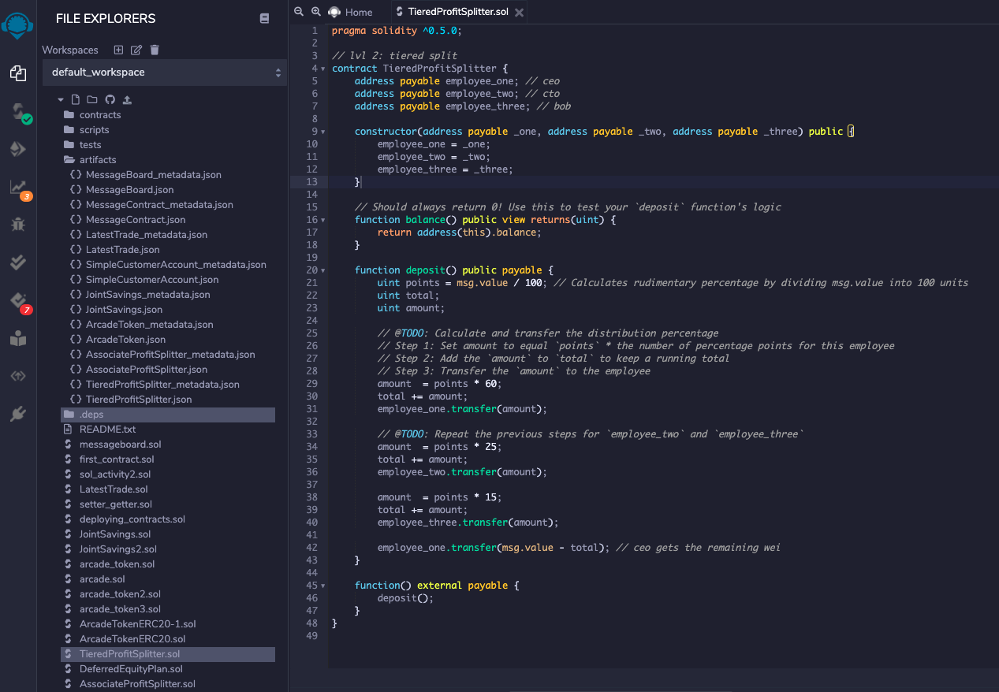
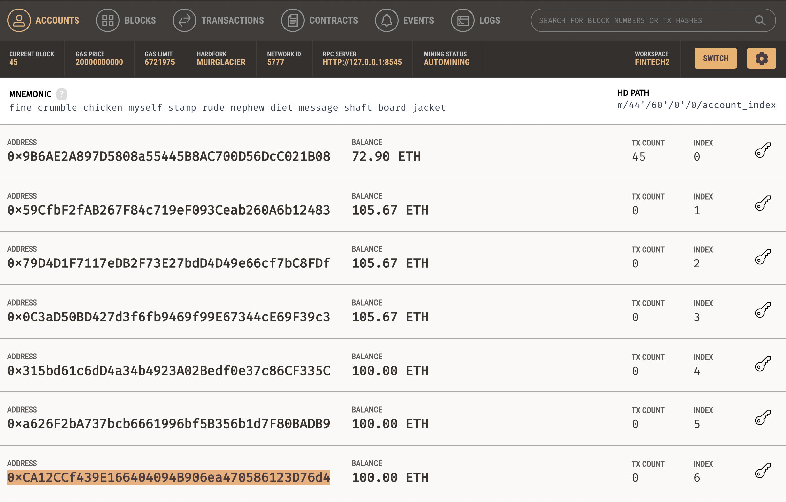
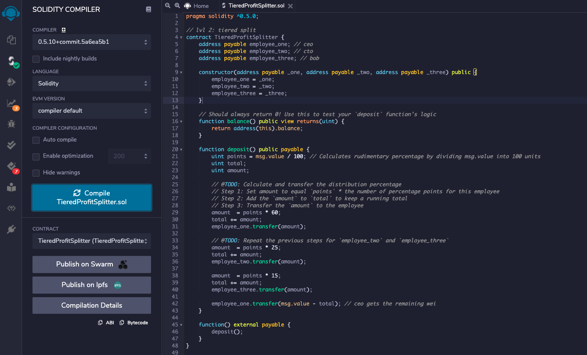
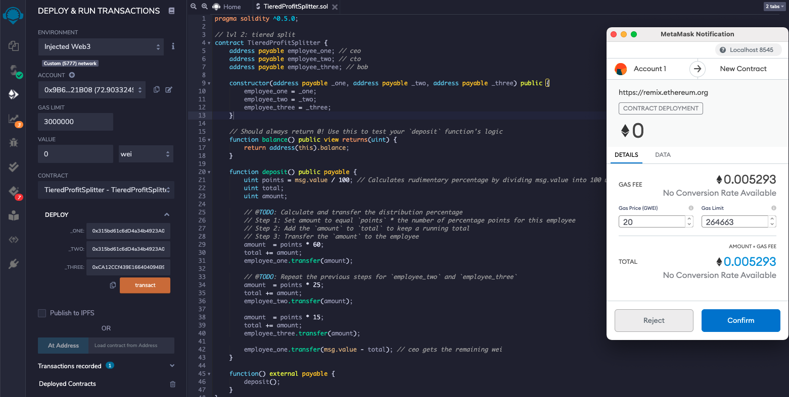
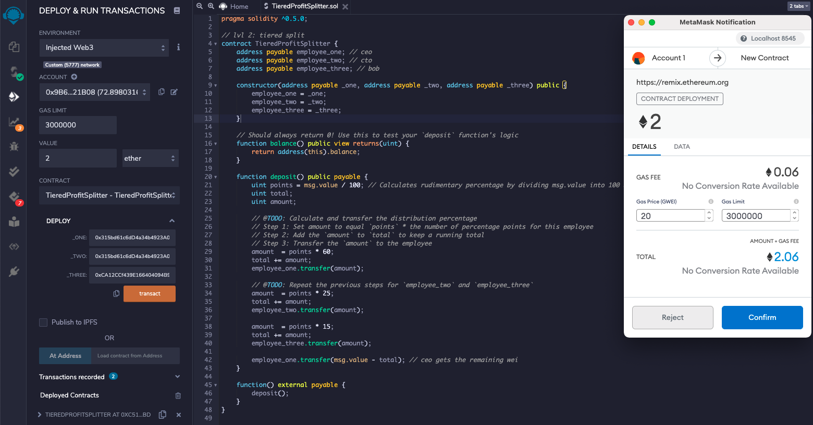
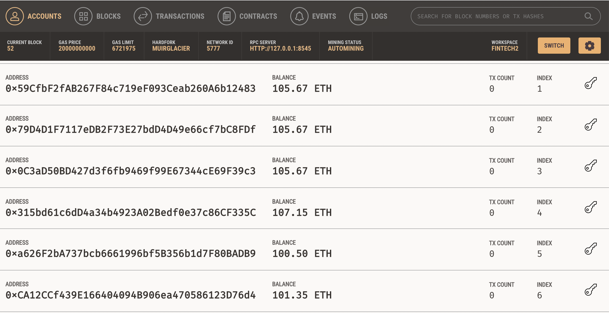

### Smart Contract Code for TieredProfitSplitter.sol

### Value in each address prior to deploying smart contract that represent 'employee_one' = CEO, 'employee_two'= CTO and 'employee_three' = bob

### Compiled AssociateProfitSplitter.sol smart contract

### Smart Contract Deployed

### Transaction is reflected in MetaMask

### Accounts are updated to reflect equal (3way) profit split of 1ETH in Ganache
